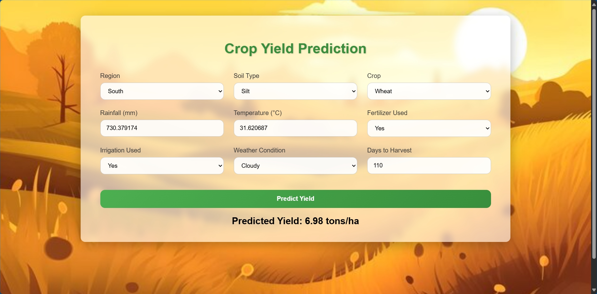

# 🌾 Crop Yield Prediction using Machine Learning

---

## 📘 Project Overview

Agriculture is the foundation of human civilization — it feeds populations, drives economies, and sustains livelihoods across the globe. Yet, **predicting crop yield** remains one of the most uncertain and data-sensitive challenges in the agricultural sector.

This project presents a **Machine Learning–based Crop Yield Prediction System**, capable of estimating **yield in tons per hectare** using multiple environmental and management variables such as rainfall, temperature, soil type, irrigation, and fertilizer use.

Built on a dataset of **1,000,000 synthetic agricultural samples**, this system applies advanced regression algorithms to learn intricate relationships among climatic, environmental, and operational factors. By integrating **data science with agriculture**, this project bridges the gap between traditional farming wisdom and predictive technology — empowering farmers, researchers, and policymakers to make **data-driven, sustainable decisions**.

The goal of this project is not only to predict yields accurately but also to demonstrate how modern AI techniques can help **increase agricultural productivity**, **reduce waste**, and **enhance resource efficiency** in a scalable, accessible way.

---

## 🧠 Problem Statement

Predicting agricultural yield has always been difficult due to the **dynamic and uncertain nature of farming environments**. Even minor variations in rainfall, soil fertility, or temperature can cause drastic yield differences, making it challenging for farmers and planners to make informed decisions.

Traditional yield estimation methods often depend on **manual surveys, expert judgment, or historical averages**, which are:

* ❌ Time-consuming and resource-heavy
* ❌ Often geographically limited
* ❌ Unable to capture complex variable interactions
* ❌ Prone to bias and subjective estimation

These limitations can lead to:

* 🚱 Inefficient use of water and fertilizers
* 📉 Economic losses from incorrect yield forecasting
* 🏭 Environmental damage due to overuse of chemicals
* 🕒 Delays in logistics and supply chain planning

This project addresses these challenges by proposing a **data-driven predictive model** that uses historical and environmental inputs to accurately estimate yield. The model transforms raw agricultural data into actionable insights that can improve both **economic efficiency and environmental sustainability**.

---

## 💡 Motivation — Why I Chose This Problem

I chose to work on **Crop Yield Prediction** because agriculture has always fascinated me as both a vital human activity and a rich source of data science potential.

In a world where population growth continues to rise while natural resources shrink, optimizing food production is not just a challenge — it’s a necessity. I wanted to explore how **machine learning can empower farmers and decision-makers** to anticipate results, plan better, and use resources more efficiently.

From my perspective as a student and learner, this project represents:

* 🌱 A way to **apply AI for societal benefit**, particularly in a field that impacts billions of lives.
* 📊 A hands-on opportunity to work with **realistic, large-scale agricultural data** and develop a complete machine learning pipeline — from preprocessing to deployment.
* 💧 A step toward **sustainable agriculture**, where we can minimize waste and maximize yield through predictive insight.
* 🧠 A comprehensive learning experience to understand how **data-driven systems can reshape traditional practices** and make them smarter.

By combining **domain understanding** with **technical execution**, I aimed to demonstrate how even students and early-career data scientists can build scalable, impactful AI systems that address real-world challenges.

---

## ⚠️ Disclaimer

While the **Crop Yield Prediction System** demonstrates modern data science techniques, robust modeling, and deployment practices, it is important to note that this project is primarily a **learning and research initiative**.

I am a **student**, and this project was created out of **personal interest and academic curiosity** — to understand how predictive analytics can be used in agriculture and to practice end-to-end ML system development.

This system is **not a production-ready agricultural advisory platform**. It may not always provide accurate or actionable results for real-world farming scenarios. The dataset used is either **synthetic** or **open-source**, intended purely for demonstration and experimentation purposes.

However, this project highlights the **direction and promise** of AI-driven agriculture — showing how machine learning can support smarter farming, sustainable practices, and better decision-making.

---